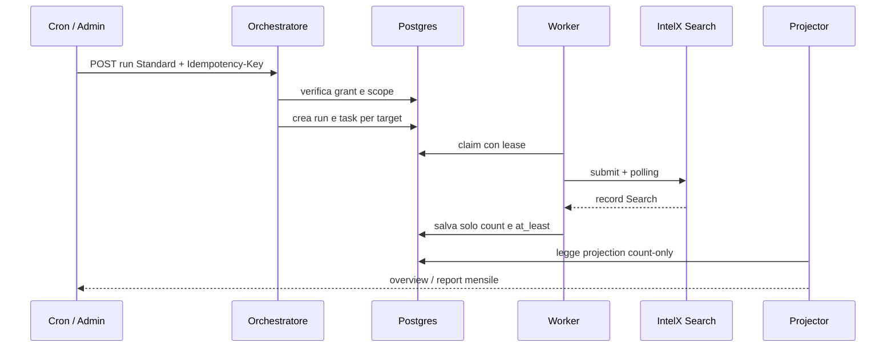
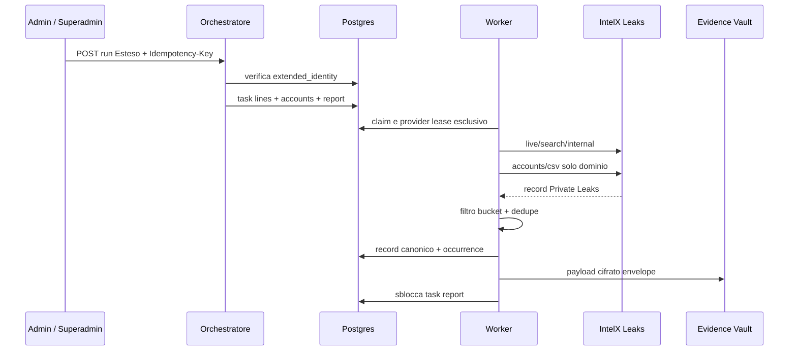

# 01 - Architettura, prodotto e flussi

## 1. Perimetro prodotto

DarkRisk360 e' il modulo di monitoraggio delle esposizioni e dei leak associati al perimetro Internet autorizzato di un'organizzazione. Condivide domini e IP con SurfaceScan360 ma mantiene separati i dati di identity intelligence e le relative regole di accesso.

### DarkRisk360 Standard

- incluso quando HiCompliance e' attivo;
- vendibile anche standalone;
- monitoraggio settimanale;
- IntelX Search API;
- dati count-only: totale, soglia `almeno N`, nuovi risultati e trend;
- nessun dettaglio account/password;
- report mensile sul mese precedente.

### DarkRisk360 Esteso

- attivabile standalone o insieme a HiCompliance;
- l'attivazione concede anche Standard;
- esecuzione esclusivamente spot;
- avvio riservato ad admin/superadmin;
- IntelX Leaks API programmatica;
- solo bucket `leaks.private.general`;
- righe leak, account e password per utenti autorizzati;
- report dedicato a ogni run;
- retention delle evidenze fino alla fine del contratto e purge entro 24 ore.

## 2. Matrice funzionale

| Funzione | Standard | Esteso |
|---|---|---|
| Scope domini/IP | Si' | Si', condiviso |
| Frequenza | Settimanale | Spot |
| Provider | Search API | Leaks API |
| Endpoint | `2.intelx.io` | `3.intelx.io` |
| Bucket | Tutti quelli consentiti dalla Search API | Solo `leaks.private.general` |
| Dettaglio record | No | Si' |
| Password | Mai | Si', solo percorso autorizzato |
| Report | Uno per mese | Uno per run |
| Avvio manuale | Contratto API disponibile | Admin/superadmin |
| Cron | Lunedi' 02:00 Europe/Rome | Nessuno |

## 3. Capability ed entitlement

Il modello V2 separa il diritto commerciale dalla modalita' tecnica.

| Capability | Sorgente grant | Effetto |
|---|---|---|
| `standard_monitor` | `hicompliance` | Standard incluso in HiCompliance |
| `standard_monitor` | `standalone_standard` | Standard standalone |
| `standard_monitor` | `extended_bundle` | Standard incluso con Esteso |
| `extended_identity` | `extended_bundle` | Run Identity Esteso |

I grant hanno `starts_at`, `ends_at`, `enabled` e vengono risolti al momento dell'accodamento. Un utente non puo' auto-concedersi la capability Esteso tramite il frontend.

## 4. Scope canonico

Lo scope V2 vive in `darkrisk_external_scope` ed e' identificato da:

```text
organization_id + target_type + normalized_value
```

Regole correnti:

- massimo quattro target attivi e approvati per organizzazione;
- domini in minuscolo, senza punto finale e senza `@`;
- IPv4 pubblici nel frontend V2;
- il database normalizza anche indirizzi IP tramite `inet`, ma il frontend rifiuta IPv6: questa differenza deve essere risolta prima di dichiarare supporto IPv6;
- email, URL, CIDR, range e selector arbitrari sono esclusi;
- duplicati eliminati per tipo e valore normalizzato;
- stati autorizzazione: `approved`, `candidate`, `revoked`.

Il limite e' protetto nel database con advisory lock transazionale, non soltanto dalla UI.

## 5. Separazione dei componenti

### Laravel

E' il confine API applicativo previsto per:

- autorizzazione business e ruoli;
- gestione scope;
- dual-write scope verso SurfaceScan360;
- creazione e lettura run;
- overview Standard;
- risultati Esteso;
- projector e distribuzione report;
- decrypt autorizzato e audit.

Questo repository contiene il client frontend del contratto Laravel, non i controller Laravel.

### Supabase

Fornisce:

- persistenza multi-tenant;
- RLS e grant;
- orchestratore e task queue;
- worker provider;
- adapter IntelX;
- cifratura dei payload Esteso;
- cron DST-safe e purge;
- runtime legacy temporaneo.

### Frontend React

Il frontend:

- non sceglie provider o bucket;
- non possiede chiavi IntelX;
- usa React Query e parser di confine;
- distingue `/dark-risk` e `/dark-risk-esteso`;
- rende Esteso solo quando la capability e il feature flag lo consentono;
- non persiste in cache i risultati Esteso (`gcTime: 0`).

## 6. Flusso Standard



Lo Standard non persiste password o dettagli dei record nel percorso V2. Il conteggio viene deduplicato nell'adapter prima di essere scritto in `result_summary`.

## 7. Flusso Esteso



## 8. IP e correlazione controllata

Per un IP Esteso:

1. il worker prova l'IP bare su `/live/search/internal`;
2. non esegue `/accounts/csv` sull'IP;
3. se il selector e' rifiutato, cerca domini correlati in SurfaceScan360;
4. usa automaticamente solo domini gia' approvati o sottodomini delle root approvate;
5. scarta e conta i candidati fuori scope;
6. marca l'occurrence `correlated_from_ip`.

Questa regola evita di attribuire al cliente leak appartenenti ad altri tenant su shared hosting.

## 9. Idempotenza e concorrenza

- Run: unique parziale su `organization_id + idempotency_key`.
- Task: unique su run, tipo task e target.
- Claim: `FOR UPDATE SKIP LOCKED` con lease e heartbeat.
- Provider Leaks: concorrenza massima uno tramite lease globale.
- Record: fingerprint deterministico e record canonico.
- Occurrence: univoca per run, record e target.
- Report Standard V2: uno per organizzazione/periodo.
- Report Esteso V2: uno per run.

## 10. Confini di responsabilita'

| Componente | Deve fare | Non deve fare |
|---|---|---|
| Frontend | mostrare e validare UX | chiamare IntelX o scegliere bucket |
| Laravel | business API, transazioni, decrypt/projector | esporre secret provider |
| Orchestratore | validare piano e accodare | interrogare provider |
| Worker | eseguire task provider e ingestion | concedere entitlement |
| Adapter | applicare contratto IntelX | persistere dati tenant |
| Database | invarianti, RLS, idempotenza | contenere API key |

## 11. Dipendenza SurfaceScan360

Lo scope approvato deve alimentare anche SurfaceScan360 con gli stessi valori. La transazione logica di dual-write e' responsabilita' dell'`ExternalScopeRegistry` Laravel. Non e' implementata con trigger SQL perche' le tabelle SurfaceScan legacy hanno shape divergenti tra ambienti.
