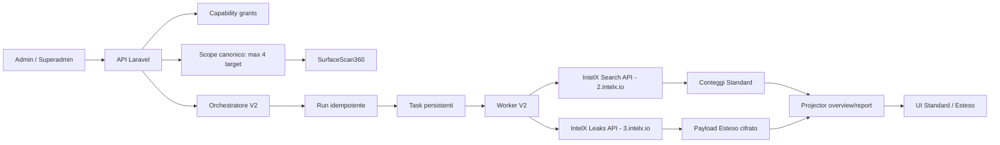

# DarkRisk360 - Documentazione tecnica DEV

Questa cartella e' la source of truth per prodotto, architettura, dati, sicurezza e promozione DEV -> Produzione di DarkRisk360.

Ultimo aggiornamento: 15 settembre 2026.

## Indice canonico

1. [Architettura, prodotto e flussi](./01-ARCHITETTURA-PRODOTTO-FLUSSI.md)
2. [Contratti IntelX e adapter](./02-INTELX-CONTRATTI-ADAPTER.md)
3. [Supabase, schema, Edge Functions e cron](./03-SUPABASE-SCHEMA-EDGE-CRON.md)
4. [Runbook DEV -> Produzione](./04-RUNBOOK-DEV-TO-PRODUCTION.md)
5. [Data dictionary](./05-DATA-DICTIONARY.md)
6. [Sicurezza, privacy e retention](./06-SICUREZZA-PRIVACY-RETENTION.md)
7. [API, frontend e report](./07-API-FRONTEND-REPORT.md)
8. [Stato implementativo e handoff](./08-IMPLEMENTATION-HANDOFF.md)
9. [Cadenza Esteso, KPI Standard e cleartext in piattaforma](./09-CADENZA-ESTESO-E-CLEARTEXT-PIATTAFORMA.md)

## Stato in una frase

Il branch DEV contiene frontend V2, schema additivo, orchestratore, worker e adapter IntelX; il backend Laravel applicativo, il dual-write transazionale dello scope, i projector report e il decrypt autorizzato dei payload V2 devono essere completati nel repository Laravel prima del rollout di produzione.

## Flusso end-to-end

## Principi non negoziabili

- Scope solo autorizzato: massimo quattro domini bare e/o IPv4 pubblici, in qualsiasi combinazione.
- Nessun dominio viene trasformato in `@dominio`.
- Standard usa esclusivamente la Search API e mostra quantita', trend e rischio aggregato.
- Esteso usa esclusivamente la Leaks API programmatica e il bucket `leaks.private.general`.
- `4.intelx.io` e `/accounts/1` non devono essere usati dal runtime.
- Nessuna chiave provider parte dal browser o entra in task, log, report o Git.
- Password e payload completi esistono soltanto nel percorso Esteso autorizzato.
- Una stessa evidenza canonica puo' ricorrere in piu' run senza essere duplicata.
- Le risposte sensibili usano `Cache-Control: no-store` e ogni reveal/download deve essere auditato.
- Esteso e' spot: non esiste un cron di scansione Identity.

## Entry point codice

- Route frontend: `src/App.tsx`
- Standard: `src/features/darkrisk/standard/StandardDarkRiskPage.tsx`
- Esteso: `src/features/darkrisk/extended/ExtendedDarkRiskPage.tsx`
- Gateway Laravel/legacy: `src/features/darkrisk/api/darkRiskGateway.ts`
- Contratti e parser: `src/features/darkrisk/domain/`
- Orchestratore: `supabase/functions/darkrisk360-orchestrator-v2/`
- Worker: `supabase/functions/darkrisk360-worker-v2/`
- Client IntelX: `supabase/functions/_shared/intelx-http-client.ts`
- Adapter Search: `supabase/functions/_shared/intelx-search-adapter.ts`
- Adapter Leaks: `supabase/functions/_shared/intelx-leaks-adapter.ts`
- Migrazione V2: `supabase/migrations/20260628195813_darkrisk360_orchestrator_v2.sql`

## Documenti storici

I file `00-master-prompt-codex.md` - `11-refactor-v2-intelx-contract.md`, `darkrisk360-all-in-one.md` e `discovery-notes.md` restano come cronologia progettuale. In caso di divergenza prevalgono questo README, i documenti canonici in maiuscolo e infine il comportamento verificabile del codice.

## Segreti locali

I file `.env.per_stefano`, `.env_per_stefano` e ogni `.env*` sono locali, coperti da `.gitignore` e non devono essere forzati in Git. Questa documentazione elenca solo i nomi delle variabili, mai i valori.
