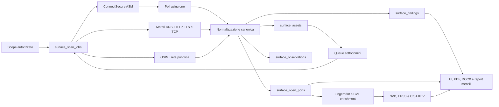

# SurfaceScan360 - Documentazione tecnica

Questa cartella e' la source of truth per architettura, dati e promozione DEV -> Produzione di SurfaceScan360.

## Indice

1. [Architettura, motori e dati](./01-ARCHITETTURA-MOTORI-DATI.md)
2. [ConnectSecure, NVD, sottodomini e scoring](./02-CONNECTSECURE-NVD-SUBDOMAIN-SCORING.md)
3. [Supabase Edge, SQL e cron](./03-SUPABASE-EDGE-SQL-CRON.md)
4. [Runbook DEV -> Produzione](./04-RUNBOOK-DEV-TO-PRODUCTION.md)
5. [Data dictionary](./05-DATA-DICTIONARY.md)
6. [Stato implementativo e handoff](./06-IMPLEMENTATION-HANDOFF.md)

## Flusso end-to-end

## Principi operativi

- Solo asset esplicitamente autorizzati o discendenti ammessi dallo scope guard.
- ConnectSecure esegue lo scan sui domini root/configurati; i sottodomini scoperti passano alla queue interna.
- La GUI legge tabelle canoniche, non payload provider raw.
- I nomi dei provider non vengono esposti in UI o nei report cliente.
- Il dato `latest-per-target` conserva l'ultimo snapshot valido quando un job live e' ancora in coda o fallisce.
- Porte e tecnologie vengono mostrate solo se esistono dati; gli asset senza porte restano visibili nella lista completa.
- Token, JWT e service role non devono comparire in Git, log, UI o report.

## Fonti autorevoli

- [Supabase Edge Functions deploy](https://supabase.com/docs/guides/functions/deploy)
- [Supabase Edge secrets](https://supabase.com/docs/guides/functions/secrets)
- [Supabase Cron](https://supabase.com/docs/guides/cron)
- [Supabase Data API grants change](https://supabase.com/changelog/45329-breaking-change-tables-not-exposed-to-data-and-graphql-api-automatically)
- [NVD CVE API](https://nvd.nist.gov/developers/vulnerabilities)
- [FIRST EPSS](https://www.first.org/epss/api)
- [CISA Known Exploited Vulnerabilities](https://www.cisa.gov/known-exploited-vulnerabilities-catalog)

## Entry point codice

- UI: `src/pages/SurfaceScan360.tsx`
- Exposure UI: `src/components/surface-scan/SurfaceScanExposureSection.tsx`
- Engine: `supabase/functions/_shared/surface-scan-engine.ts`
- ConnectSecure: `supabase/functions/connectsecure-scan/index.ts`
- Adapter ConnectSecure: `supabase/functions/_shared/connectsecure-adapter.ts`
- Exposure summary e score: `supabase/functions/surface-exposure-summary/index.ts`
- Score V2: `supabase/functions/_shared/exposure-score-v2.ts`
- CVE enrichment: `supabase/functions/cve-enrichment/index.ts`
- Report canonico: `supabase/functions/surfacescan360-ai-report/index.ts`
- Report mensile: `supabase/functions/surfacescan360-monthly-report/index.ts`
